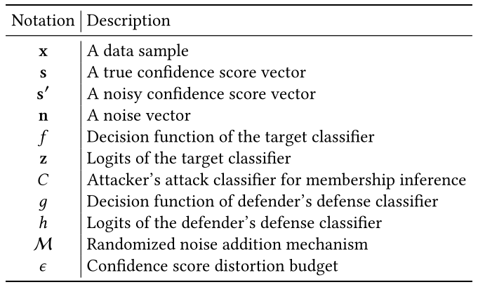
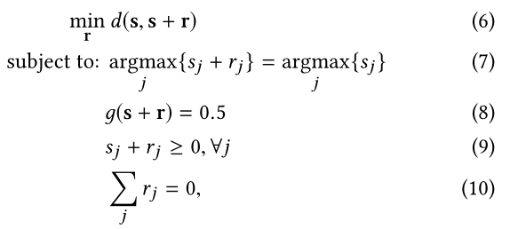
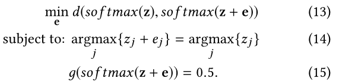
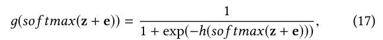
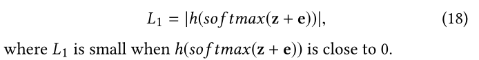

# **MemGuard: Defending against Black-Box Membership Inference Attacks via Adversarial Examples**

# **1. 现有问题**
大多数现有成员推理攻击防御方法在训练目标分类器时使用差分隐私技术。这类防御受到两个关键限制：

（1）它们没有置信度向量的正式效用损失保证。

（2）它们实现了次优的隐私-效用权衡。

# **2. 本文工作简介**
**研究目标**：
对于机器学习黑盒成员身份推理攻击：  
（1）攻击者的分类器无法准确推理出查询数据样本中的成员或非成员。  
（2）置信度向量的效用损失是有界的。具体而言，噪声不应改变查询数据样本的预测标签。

**主要贡献**：  
（1）提出了MemGuard，这是首个在黑盒设置下针对成员身份推理攻击的具有正式损失-效用保障的防御方法。
（2）提出了一种新的算法来寻找满足MemGuard第一阶段中唯一效用损失约束的噪声向量。此外，在第二阶段，推导了MemGuard将噪声向量添加到置信度向量的概率的解析解。  
（3）在3个真实世界的数据集上评估MemGuard，结果表明，MemGuard是有效的且优于现有的防御系统。

**本文意义**：  
（1）可以有效防御成员身份推理攻击，并实现比现有防御方法更好的隐私效用权衡。  
（2）首次表明对抗性样本可以用作防御机制，以抵御成员推断攻击。

**关键思想**：攻击者使用分类器区分成员或非成员，且分类器容易受到对抗性样本的攻击。基于这种观察结果，作者建议将精心制作的噪声向量添加到置信度向量中，以将其转化为误导攻击者分类器的对抗性样本。

# **3. 相关工作**
- 传统数据库中的成员推理攻击（略）
- 机器学习中的成员推理攻击（略）
- 现有防御方法:
    - L-2正则化
    - 最大-最小博弈
    - Dropout
    - 模型堆叠
    - 差分隐私  
- 现有方法缺陷：同“1. 现有问题”。
- 其他模型攻击手段，如属性推断攻击、模型窃取攻击等。
- 对抗性样本（略）

# **4.  问题规范定义**
  
三类参与方：模型提供者、攻击者和防御者
- 模型提供方：用正确的数据集训练出正确的模型，并将其作为云服务或客户端软件黑盒提供，模型使用者可以用模型预测自己的数据，得到置信度向量。本文中假定模型为神经网络。
- 攻击者：攻击者训练一个二分类器，旨在推断某输入数据是否在模型提供者的专有训练数据集中。
- 防御者：防御者可以是模型提供者或其信任的可信第三方。攻击者使用模型预测时，防御者在模型预测结果返回给攻击者前，向得到的置信度向量中添加噪声。防御者要实现两个目标：（1）攻击者的推理攻击结果不准确；（2）置信度向量的效用损失是有界的。  
实现这两个目标的挑战：
-  目标（1）挑战：防御者不知道攻击者的攻击模型。解决方案：  
	- 防御者自己训练一个防御分类器来尝试模拟成员推理攻击。具体而言，如果防御分类器根据置信度向量预测出正确的的成员（或非成员），则防御者添加一个噪声向量，使得防御分类器预测错误。然而，当攻击者知道防御机制时，攻击者可以很容易地调整其攻击以实现高精度。特别是，攻击者在其攻击分类器预测数据样本为非成员（或成员）时输出成员（或非成员）（即反着输出）。另一种方法是添加噪声向量，使得防御分类器总是预测成员（或非成员）。然而，对于一些真实的置信度向量，这种方法可能需要违反置信度向量效用损失约束的噪声。
	- 为此，可以使用这样一种随机噪声添加机制M。具体地说，给定真实的置信度向量，防御者以概率M(n|s)从可能的噪声向量空间中采样噪声向量，并将其添加到真实的置信度向量中。由于随机噪声被添加到真实的置信度向量，因此决策函数g输出该条数据是成员的随机概率。防御者的目标是使输入数据被g预测为成员的概率的期望值接近0.5。换句话说，防御者的目标是添加随机噪声，使得防御分类器随机猜测数据样本为成员或非成员。

-  目标（2）挑战：如何量化置信度向量的效用损失。解决方案：引入两个效用损失指标，分别是：
	- 标签损失（Label Loss）：如果真实置信度向量和噪声置信度向量预测输入数据样本得到相同标签，则该样本标签损失为0，否则该样本标签损失为1。防御机制的总体标签损失是所有查询的数据样本的平均标签损失。在一些关键应用中（如金融和医疗保健），即使1%的标签丢失也可能无法忍受，因此本工作的目标是实现0标签损失，即噪声不会改变任何输入数据样本的预测标签。 
	- 置信度失真（Confidence Score distortion）：输入数据样本的置信度向量向用户提供更多的关于数据样本标签的信息。因此，添加的噪声不应该过度扭曲置信度向量。首先，噪声置信度向量应该仍然是概率分布（各标签概率之和为1）。其次，原始置信度向量和噪声置信度向量的距离应该很小（度量向量距离有多种方式，本文采用L-1范数）。

规范定义两个目标后，可以正式定义问题：
（定义3.1截图）

# **4. MemGuard**
总览：寻找随机噪声添加机制是为了解决问题定义等式1中的优化问题。我们考虑两个场景，取决于g(s)是否为0.5。
- 场景1：若g(s)=0.5，那么以概率1添加噪声**0**，这样目标优化函数的值为0。
- 场景2：若g(s)≠0.5，表达噪声置信度向量的概率分布和解决优化问题是很困难的。为解决该问题，观察到，根据防御分类器的决策函数g的输出，噪声空间可以分为两组。具体地说，对于其中一组中的噪声向量，如果将它们中的任何一个添加到真实置信度向量中，那么决策函数g输出0.5作为成员的概率。对于另一组中的噪声向量，如果将它们中的任何一个添加到真实置信度向量，那么决策函数g输出的成员概率不是0.5。
- 基于这一观察，提出了两阶段框架来近似解决优化问题。  
	- 第一阶段：寻找r（r为使置信度向量失真最小，且使g(s+r)=0.5的噪声），正式的优化问题如下图所示：
      
    注：噪声向量各元素之和为0是因为原置信度向量各元素之和为1，且二者相加各元素之和仍需为1（符合概率分布）。  
    该优化问题可以视为找到一个对抗性样本来规避防御分类器。   
    解决方案：  
        >$$因为s=softmax(z)$$
        >$$使s+r=softmax(z+e)$$  
        >通过softmax的性质得到新的优化问题，消除了满足概率分布的约束：
        >  
        >求解出上述问题的e后，可以计算出r。
        >$$r=softmax(z+e)-softmax(z)$$
        >没有概率分布约束的优化问题仍然很难解决，因为剩余的两个约束是高度非线性的。为此，可以将约束转化为目标函数。  
        >将等式15中的约束转化为目标函数：我们认为防御者的二元防御分类器是一个神经网络，其输出层有一个具有sigmoid激活函数的单个神经元。因此，我们有：  
        
        其中h()是倒数第二层的输出。
        $g(softmax(z+e))=0.5$意味着$h(softmax(z+e))=0$。  
        因此将等式15转化为下式：
        
    
    > 将等式14中的约束转化为目标函数：把输出标签记作$l$，则$l=argmax_j\{s_j\}=argmax_j\{z_j\}$。约束14意味着$z_l+e_l$是**z**+**e**向量中的最大值。
    >
    > 取$L2=ReLU(−z_l−e_l+max_{j|j≠l}\{\z_j+e_j\})$  
    > 再取$L3=d(softmax(z),softmax(z+e))$  
    > 最终非优化问题变为：$min_e L=L1+c2·L2+c3·L3$，其中c2和c3用于平衡三个指标。  
    > 解决非约束的优化问题：设计了一种基于梯度下降的算法，如下图所示。
    > （算法图片）
    > 由于我们试图找到一个置信度偏差较小的噪声向量，因此迭代搜索一个较大的c3。对于每个给定的c3，我们使用梯度下降来确定满足等式14和等式15中的约束条件。当我们无法找到满足这两个约束条件的向量时，搜索c3的过程停止。具体而言，给定c2、c3和学习率β，迭代更新向量变量（即算法1中的内部while循环）。由于将等式14和等式15中的约束转换为目标函数，因此不能保证在迭代梯度下降过程中满足这些约束。所以需要在梯度下降的每个过程中检查是否满足两个约束（即算法1中的第8行）。其中第16行后一个条件近似满足等式15的约束。按说应该对c2也进行多次搜索，但这样效率太低，因此也可以只搜索c3。得到e后，因为$s+r=softmax(z+e)$，所以可以计算出r。

- 第二阶段：
- >在第一阶段之后，我们有两个代表性的噪声向量。一个是**0**，另一个是**r**。在第二阶段，我们假设随机噪声相加机制是两个代表性噪声向量上的概率分布，而不是整个噪声空间（即以一定概率分布添加代表性噪声，而不是任意添加噪声）。具体而言，假设防御者以p的概率取代表性噪声r和1-p的概率取代表性噪声0，且防御者把取到的噪声添加到真实置信度向量上。通过这种简化可以把等式1中的优化问题转化为下面的优化问题（即用概率表示出期望）。
- >(等式1截图)
- >(等式21,22截图)
- >其中该约束意味着预期的置信度失真受到预算的限制。注：此处省略了等式2、等式4和等式5中的其他三个约束。因为两个代表性噪声向量已经满足这些约束。此外，我们可以得出简化优化问题的解析解：
- >等式23图。
- 如果防御者每次对同一查询数据样本随机采样两个代表性噪声向量中的一个，那么攻击者可以通过多次查询同一数据样本来推断真实的置信度向量。我们认为攻击者知道我们的防御机制，包括置信分数失真度量、预算ε，并且噪声向量是从两个代表性噪声向量中采样的，其中一个是0。
- 假设攻击者n次从目标分类器查询相同的数据样本。攻击者得到置信度向量s1 m次，和置信度向量s2 n−m次。其中一个置信度向量是s+r，另一个是真正的置信度向量s。由于攻击者接收到两个不同的置信度向量，因此攻击者可以知道采样概率p。此外，由于等式23中的距离d(s,s+r)不依赖于s和s+r的顺序。攻击者还可以估计防御者返回置信度向量s1和s2的概率（m/n，n-m/n）。如果m/n更接近p，则攻击者预测s2是真实置信度向量，否则攻击者预测s1是真实置信度向量。
- 为了应对这一挑战，建议防御者对代表性噪声进行采样时使用一次性随机性，防御者总是对相同的查询数据样本返回相同的置信度向量。具体而言，对于查询的数据样本，防御者量化查询数据样本的每个维度，并计算量化数据样本的哈希值。然后，防御者在[0,1]范围内，以哈希值为种子，生成一个伪随机数p'。如果p'<p，防御者将代表性噪声向量添加到真实置信度向量中，否则防御者不添加噪声。因此，攻击者不知道返回的置信度向量是否为真。

# **5. 实验评估**
数据集：
- Location：该数据集有5010个数据样本和446个二进制特征，每个特征表示用户是否访问了特定区域或位置类型。数据样本分为30个簇，代表了一个30分类问题，其中每个簇都是一个类。
- Texas100：该数据集有67330个数据样本和6170个二进制特征。这些特征代表了受伤的外部原因（如自杀、药物滥用）、诊断、患者接受的手术以及一些一般信息（如性别、年龄和种族）。关注最常见的100种手术，分类任务是使用患者数据预测患者的手术，该数据集代表一个100分类问题。
- CH-Mnist：该数据集有5000张图片，每张图片大小为64x64。该数据集用于对结直肠癌患者的组织学切片上的不同组织类型进行分类，代表一个8分类问题。

数据集分割：每个数据集被分为不相交的四个集合D1、D2、D3、D4，使用D1、D2、D3训练目标分类器、攻击分类器和防御分类器，使用D1∩D4评估攻击分类器的准确率。

模型选择：对于Location和Texas100数据集，使用具有4个隐藏层的全连接神经网络作为目标分类器。四层神经元的数量分别为1024、512、256和128。将流行的激活函数ReLU用于隐藏层中的神经元。输出层中的激活函数为softmax。采用交叉熵损失函数并使用随机梯度下降（SGD）来学习模型参数。以0.1的学习率训练200轮，在第150轮后，将学习率降低至0.01，以实现更好的收敛。对于CH-MNIST数据集，目标分类器的神经网络架构如下图所示。同样也采用交叉熵损失函数，并使用SGD来学习模型参数。以0.1的学习率训练了400轮，在第350轮后，学习率下降为0.01。对于每个数据集，使用D1数据集来训练目标分类器。

（Table 2）

结果如下图所示，下图显示了目标分类器在三个数据集上的训练和测试精度，其中测试精度是通过使用目标分类器对不在D1中的数据样本进行预测来计算的：

（Table 3）

成员身份推理攻击：称D1∩D4为评估数据集，这样其中一半为目标分类器训练集中的数据，另一半非目标分类器训练集中的数据。考虑两类当时最先进的黑盒成员推理攻击手段——自适应攻击和非自适应攻击。非自适应攻击中攻击者不根据防御策略调整攻击分类器，而自适应攻击中攻击者会根据防御策略调整攻击分类器。

非自适应攻击：

- 随机猜测攻击（Random guessing (RG) attack）：预测出成员和非成员的概率都为0.5.
- 神经网络攻击（Neural Network (NN) attack）：假设攻击者知道目标分类器的训练数据集分布和分类器结构。进一步将D2拆分成两部分。用其中一部分训练与目标分类器相同的阴影分类器，用阴影分类器预测这部分数据和另一部分数据，将预测的置信度向量作为新的训练集训练攻击分类器。
- 随机森林攻击（Neural Network (NN) attack）：该攻击与NN攻击相同，只是RF攻击使用随机森林作为攻击分类器，而NN使用神经网络作为攻击分类器。这种RF攻击是为了证明，即使攻击分类器和防御分类器（神经网络）使用不同类型的算法，本文的防御机制仍然有效。
- NSH攻击（NSH attack）：Nasr, Shokri, and Houmansadr提出的一种攻击方法。

自适应攻击：

-  对抗性训练（Adversarial training (NN-AT)）：使用对抗训练来调整NN攻击，并将调整后的攻击表示为NN-AT。具体而言，对于D2'和D2''中的每个数据样本，攻击者使用阴影分类器预测其置信度向量。然后，攻击者使用本文防御的第一阶段来找到代表性的噪声向量，并将其添加到置信度向量，以获得有噪声的置信度向量。最后，攻击者通过将D2'和D2''中数据样本的真实置信度向量及其对应的噪声版本作为训练数据集来训练攻击分类器。
-  舍入（NN-R）由于本文的防御将精心设计的小噪声添加到置信分数向量中，因此在使用攻击分类器预测成员/非成员之前，自适应攻击会对每个置信度分量进行舍入。具体而言，攻击者将每个置信度分数取为一个小数，并使用NN攻击。

不使用防御方案时，这些攻击方式的攻击成功率如下图所示。

table 4

防御设置：

- 防御分类器设置：防御者自己训练分类器来执行成员推理攻击，本文认为防御分类器是一个神经网络。然而，因为防御者不知道攻击者的攻击分类器，所以假设防御分类器和攻击分类器使用不同的神经网络架构。具体而言，本文考虑了三种不同的防御分类器，以研究防御分类器对MemGuard的影响。防御分类器是分别具有2、3和4个隐藏层的全连接神经网络。防御者使用目标分类器预测D1和D3中每个数据样本的置信度向量。D1和D3中数据样本的置信度向量分别具有“成员”和“非成员”标签。防御者将这些置信度向量作为训练数据集来训练防御分类器，该分类器以置信度向量作为输入并预测成员或非成员。

- 参数设置：    
  - max_iter=300、β=0.1、c2=10、c3=0.1（初始值）

实验结果：
- Memguard的有效性：随着置信度失真阈值的增大，可以降低推理攻击准确率，最多可以降到接近随机猜测的0.5准确率。Figure 1。
- 成员和非成员的置信度向量之间的可区分性：对每个样本计算其归一化熵，成员/非成员样本的归一化熵构成两个分布，两个分布越接近，说明成员和非成员越不可区分。Figure 2。
- 搜索c2 vs 搜索c3：优化目标L对c3的变化更敏感，所以最好固定c2搜索c3。Figure 3。
- 防御分类器的影响：MemGuard对不同的防御分类器具有相似的效果，意味着精心设计的噪声向量可以在分类器之间传递。Figure 4。
- Memguard相比于现有防御的优越性：对于置信度失真的值，除模型堆叠外（作者专门测试了模型堆叠的置信度失真和标签损失，明显发现其较大，后面对比可不考虑），其他方法也有相应参数可以控制。在相同置信度失真程度下，Memguard推理成功率最低，在相同推理成功率下，Memguard置信度失真程度最低。Figure 5。其他方法均有标签损失（即扰动太大使预测结果错误），但Memguard的标签损失始终为0，只要原始的分类器预测正确，Memguard结果也就正确。Figure 6。

# **6. 讨论、局限性、结论、未来工作**

再次介绍了本方法的主要思想、意义等，并建议尝试采用本方法防御其它机器学习攻击。（略）

