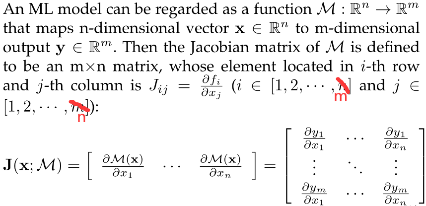
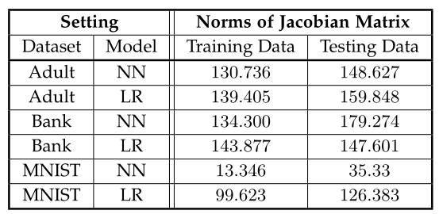
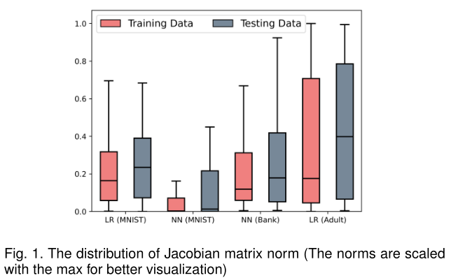
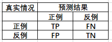
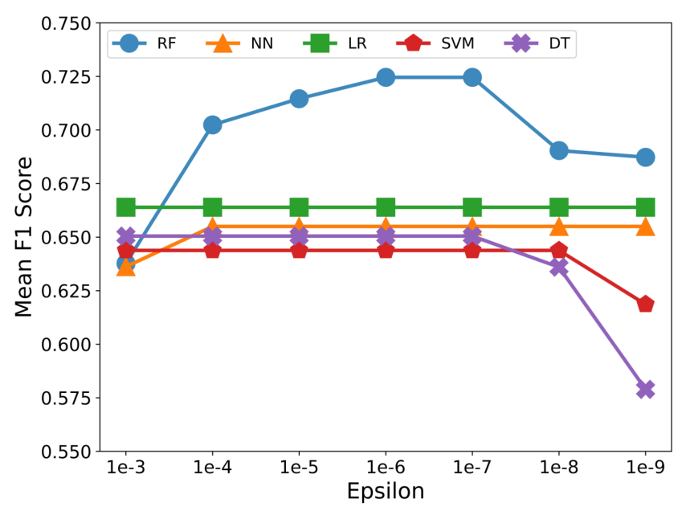
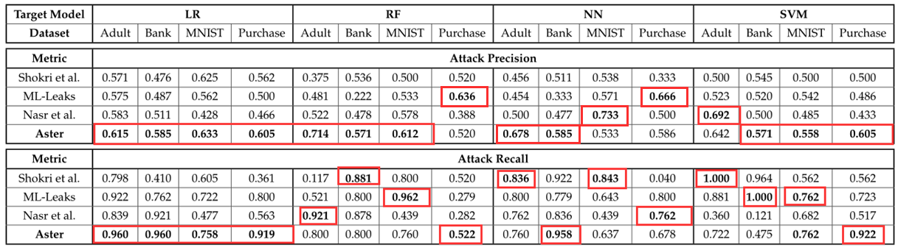
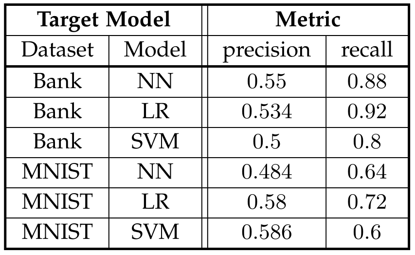
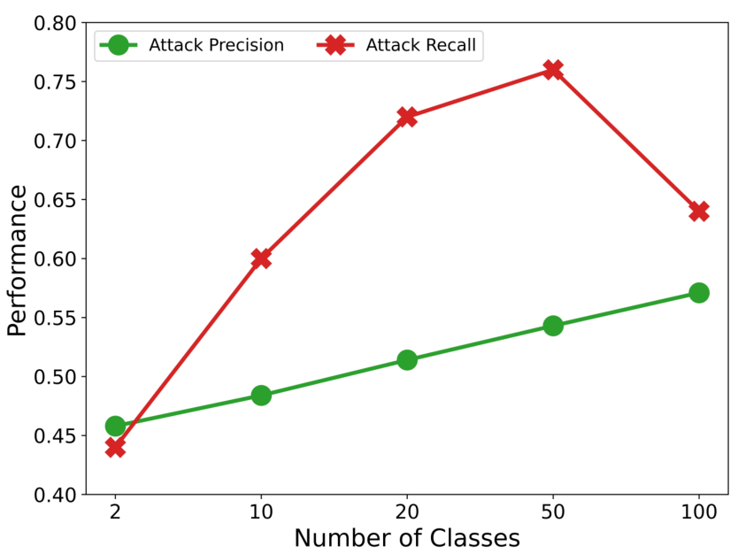
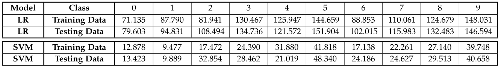
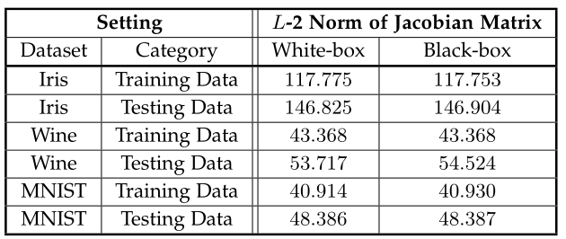

# **Abstract**
- 机器学习易受到成员推理攻击。

- 提出Aster来解决这一问题，只需要机器学习黑盒模型API和待推理的数据样本。

- **理论基础**：与非训练数据（即测试数据）相比，完全训练的ML模型的训练数据通常具有较低的预测灵敏度。较低的灵敏度意味着当在相应的特征空间中扰动训练样本的特征值时，从目标模型获得的扰动样本的预测趋于与原始预测一致。

- **方法概述：** 用雅可比矩阵量化预测灵敏度，该矩阵可以反映每个特征的扰动与相应预测变化之间的关系。然后，我们将具有较低值的样本视为训练数据。

# **1. Introduction**
- ML模型容易受到多种攻击，包括对抗攻击、模型窃取攻击、模型反转攻击和隐私侵犯攻击。

- 本文关注成员推理攻击（MIA），其目标是确定样本是否属于给定模型的训练集。MIA可能会严重危及模型的数据安全。

    > 例如：银行训练并发布了一个预测用户信用级别的ML模型用于贷款，如果能通过黑盒MIA攻击知道某人在不在训练集中，就能知道他是不是这家银行的客户。

- 大多数MIA需要有先验知识，比如知道模型的结构、知道训练集的数据分布等。（然而大多数模型只提供黑盒访问接口，包括谷歌和亚马逊的一些服务）

- 本文提出Aster，只需要扰动目标记录的特征空间和目标ML模型的黑盒预测界面。

- **直觉基础：** 与非训练样本相比，训练好的ML模型通常对其训练样本上的特征值扰动不太敏感。
    > 解释：   
    一般来说，随着训练过程的进行，ML模型将对训练数据的预测越来越有信心。当训练过程结束时，训练模型通常对其训练数据附近的不同输入具有很高的鲁棒性（或者说是预测灵敏度）。   
    因此，对于完全训练的ML模型，对训练样本的扰动不会导致模型预测输出的显著变化，而对非训练样本的扰动则会引起模型输出的显著变化。

- 虽然Aster思想不复杂，但还是面临两个问题：   
     ① 如何衡量模型对不同输入的灵敏度？   

    > 一种简单方法是向目标样本添加扰动，导出模型的变化。然而，对应于不同扰动程度的输出变化难以直接比较。为了实现统一的测量，使用模型输出对输入的导数来获取灵敏度。由于ML模型的输入和输出通常具有大量维度，需要获得模型输出关于每个特征的偏导数，然后将所有偏导数组合成矩阵，该矩阵恰好是雅可比矩阵，以测量目标样本的灵敏度。  

    ② 如何针对单个样本发起攻击？  

    > 由于没有目标样本成员的属性，Aster只能利用无监督算法将样本分成两组。然而，现有的无监督聚类算法不能在只有一个样本的训练数据集上执行。为了解决这个问题，本文通过向原始样本添加噪声来手动生成一些样本。噪声样本不太可能用于目标模型的训练过程，因此可以利用这些样本来满足聚类算法的要求。（详见4.3节）

# **2. Related Work**
1. 较早的机器学习推理攻击方法：
    - 利用单/多个影子模型（需要训练数据的先验知识）  
        > 影子模型需要训练数据，最好得到一部分真实训练数据；  
        或者知道真实训练数据分布，通过分布生成一组数据；  
        或者获得与训练数据相似的数据，视为训练数据的有噪声版本。  
        **注：此方法也提供了不能达到以上条件时，用目标模型生成训练数据的方法。**

    
    - 利用所有训练数据的平均损失（需要所有的训练数据）
    
    - 基于模型的激活函数、预测和损失，提取了目标模型的成员得分（白盒情况）
    
    - 推导一组描述特殊特征使用的参数I（白盒情况）

2. 近期的工作更具有实践价值（解释起来比较复杂）

3. 雅可比矩阵介绍：雅可比矩阵已广泛应用于许多不同领域。它有助于分析当输入发生某些变化时系统的输出如何反应。本文利用雅可比矩阵来测量目标模型对不同样本的灵敏度。然后计算雅可比矩阵的范数，将目标样本分为成员组和非成员组。
    > 
    第$(i,j)$个元素表示输入样本第$j$个特征值的变化与该样本属于第$i$类的预测概率的变化之间的关系。

# **3. MOTIVATION**
- 观察：训练样本的雅可比矩阵与非训练样本相比通常具有较小范数。  
- 可行性证明：
对三个数据集进行了实验，研究雅可比矩阵对于训练集和测试集中的样本的不同分布：  
    - 使用标准训练过程训练了6目标模型，对于每个目标模型，有来自测试集的100个样本和来自训练集的100多个样本。
    - 然后，近似这些样本的雅可比矩阵范数（近似方法见第4节），并比较平均范数。
    - 结果如图所示，与观察完全一致：对于每个目标模型，不同模型的范数幅度不同，但训练集样本的平均雅可比矩阵范数严格小于测试集样本的雅可比平均矩阵范数。
    

    - 此外，样本的雅可比矩阵范数对于四种不同目标模型的分布如图所示。它表明，训练集样本的雅可比矩阵范数分布通常低于测试集样本的分布。
    

- 结论：从初步实验中，可以看到模型训练集中的样本对扰动不太敏感。预测灵敏度可以通过给定样本相对于ML模型的雅可比矩阵来获取。因此，可以使用雅可比矩阵的范数来测量目标样本的预测灵敏度。

# **4. Design of Aster**
## **（1）威胁模型**
目标模型：

- 表示训练数据受到攻击的受害者。（专注于分类ML模型）。模型预测过程形式化表示：$\mathbf{y}=M(\mathbf{x})$，其中$\mathbf{x}$是输入样本，$\mathbf{y}$是预测概率向量，$M$表示目标模型的黑盒API。

Aster先验知识：

- 无法获得有关目标模型的结构、类型、参数、训练算法和设置的信息，以及其训练数据的统计信息。因此，从目标模型中获得的唯一信息是给定输入的预测概率向量。

Aster的能力：

- 攻击者和模型的唯一交互方式是：$M(\mathbf{x}) = [y^1, y^2, · · · , y^c, · · · , y^{|C|}]$，其中$C$是目标模型可以采用的类别标签集，$y^c$是输入样本属于类别$C$的概率。对手可以从目标模型$M$接收的唯一信息是预测概率向量。

Aster的目标：

- $A(x_t, M) → In/Out$

## **（2）Aster方法**
2个主要步骤：①雅可比矩阵近似 ②成员推理

- ①雅可比矩阵近似：
    > 在黑盒模式下无法用解析的方法求出偏导数，所以用数值近似：$$\frac{\partial y_{j}}{\partial x_{i}} \approx \frac{\mathcal{M}(\mathbf{x}+\epsilon)-\mathcal{M}(\mathbf{x}-\epsilon)}{2 \epsilon}$$
    $\epsilon$是添加到输入样本的第$i$个特征值的小值

    对$\mathbf{x}$中的每个特征依次重复$\frac{\partial M(\mathbf{X} )}{\partial x_{i}}=\left[\frac{\partial y_{1}}{\partial x_{i}}, \frac{\partial y_{2}}{\partial x_{i}} \cdots \frac{\partial y_{m}}{\partial x_{i}}\right]$，并将偏导数组合到雅可比矩阵中。

    使用$J(\mathbf{x};M)$的$L-2$范数来表示目标样本的预测灵敏度。对于$m×n$矩阵$A$，$A$的$L-2$范数可通过下式计算：$$\|A\|_{2}=\left(\sum_{i=1}^{m} \sum_{j=1}^{n}\left|a_{i j}\right|^{2}\right)^{\frac{1}{2}}$$

- ②成员推理:

    方法：利用无监督聚类方法将一组目标记录分组为2个聚类，然后确定平均灵敏度较低的聚类作为M的训练集的成员。
    
    然而，通过实验发现，当簇数较大时，Aster的性能可能更好。因此，作者尝试不同数量的集群，并根据针对不同模型和数据集的平均攻击性能将其设置为6。
    
    作者比较了几种聚类算法，包括K-Means, Spectral Clustering和DB-SCAN。Spectral Clustering在实验中获得了最佳性能。
    > Spectral Clustering（谱聚类算法）数学原理比较复杂，比较适合于少量类别的聚类。  
    参考资料：[谱聚类算法介绍](https://blog.csdn.net/qq_24519677/article/details/82291867)

## **（3）讨论：针对单个目标样本的Aster**
- 在同时对多个样本进行攻击时可以正常采用聚类的方法。但如果攻击者只能获得一个目标样本，则攻击可能会失败，因为现有的无监督聚类算法无法在只有一个样本的训练数据集上执行。

- 为解决此问题，首先复制目标样本多次，然后在每次复制中添加一些随机噪声。大多数带噪副本从未参与目标模型的训练过程，因此，可以首先生成目标样本周围的局部样本。然后均匀随机地选择$x_t$的一部分特征，并扰动这些特征的值。
    > 对于数字特征，我们直接将随机噪声添加到原始特征值上。对于分类特征，我们从该特征可以采用的范围中随机选择另一个标签。

    在扰动副本之后，我们计算$x_t$及其扰动副本的雅可比矩阵。

- 如此，可以直接重用相同的聚类方法来推断$x_t$的成员属性。如果目标样本来自目标模型的训练集，则扰动副本的雅可比范数应大于目标样本的雅可比范数。否则，如果目标样本不是来自目标模型的训练集，则一些受干扰的副本可能接近来自目标模型训练集的样本。目标样本的雅可比范数更有可能被划分为具有较大平均雅可比模的组。

# **5. Performance Evaluation**
## **5.1 实验设置**
- **数据集：** UCI Adult、Purchase、MNIST和Bank

- **目标模型：** 为了全面评估MIA的性能，使用四种不同的ML算法来训练目标模型，包括随机森林（RF）、神经网络（NN）、逻辑回归（LR）和支持向量机（SVM）。由于假设目标模型被部署为黑盒，因此仅在目标模型的训练过程完成后使用目标模型的预测接口。

- **评价指标:** 主要使用两个标准度量——精度和召回率，来评估Aster的性能。

    > - 精度表示预测为正的样本中有多少是真正的正样本（找得对）。
    > - 召回率表示样本中的正例有多少被预测正确了（找得全）。   
    > - 换句话说，精确性衡量攻击准确度，而召回率衡量攻击覆盖率。     
      
    $精度=TP/TP+FP$  
    $召回率=TP/TP+FN$

    在研究不同选择对$\epsilon$的影响时，也使用了$F1$分数。$F1$分数可以衡量精确率（即攻击准确度）和召回率（即攻击覆盖率）之间的平衡。（实际就是二者的调和平均数）
    > $$F_{1}=2 \cdot \frac{\text { precision } \cdot \text { recall }}{\text { precision }+\text { recall }}$$

- **对比方法：**
    - Shokri et al：[R. Shokri, M. Stronati, C. Song, and V . Shmatikov , “Membership
inference attacks against machine learning models,” in Proceedings
of IEEE S&P, 2017, pp. 3–18.](https://arxiv.org/pdf/1610.05820)
    - ML-Leaks：[A. Salem, Y . Zhang, M. Humbert, P . Berrang, M. Fritz, and
M. Backes, “ML-Leaks: Model and data independent membership
inference attacks and defenses on machine learning models,” in
Proceedings of NDSS, 2019](https://arxiv.org/pdf/1806.01246)
    - Nasr et al：[M. Nasr, R. Shokri, and A. Houmansadr, “Comprehensive privacy
analysis of deep learning: Passive and active white-box inference
attacks against centralized and federated learning,” in Proceedings
of IEEE S&P, 2019, pp. 739–753.](https://arxiv.org/pdf/1812.00910)

## **5.2 $\epsilon$的选择**
由$\frac{\partial y_{j}}{\partial x_{i}} \approx \frac{\mathcal{M}(\mathbf{x}+\epsilon)-\mathcal{M}(\mathbf{x}-\epsilon)}{2 \epsilon}$可知$\epsilon$对偏导数的近似结果有很大影响，对不同模型进行实验，结果如下：

因此本文选取$\epsilon=1e-6$，这也在各种模型下都能得到可接受的结果。

## **5.3 Aster的表现**
   

- 排第一的时候比较多
- 不排第一也很少垫底

## **5.4 Aster在攻击单个样本时的表现**
- 分别从目标模型的训练数据和测试数据中提取样本，然后对每个样本逐一执行Aster。具体而言，将每个样本复制49次。

- 在Bank和MNIST数据集上进行实验，结果如表所示。从表中可以看出，通过向样本中添加随机噪声，仍然可以在这些目标模型上获得良好的结果。
    

- 总体而言，通过添加额外的复制和扰动步骤，Aster可以获得处理针对单个目标样本的推理攻击的能力。自然地，当攻击一个单一样本（即目标样本）时，存在一个有问题的情况，就是扰动样本都是非成员。在这种情况下，我们可以发现目标数据集中的成员和非成员不平衡将极大地影响Aster的性能，这在未来仍需要更多的探索。

## **5.5 类别数的影响**
- 为量化目标模型的类别数对Aster性能的影响，进一步使用Purchase数据集进行了一组实验。具体而言，首先采用K均值算法将购买数据集中的样本分别聚类为2、10、20、50和100个聚类，然后将聚类结果作为类标签分配给每个样本。然后，我们在具有不同类别数的购买数据集上训练一系列神经网络模型。之后，我们对这些模型依次执行Aster。

- 实验结果如图所示。从结果可以看出，类别较少的模型泄漏的训练数据信息较少，因此Aster的性能随着类数的增加而提高。

## **5.5 不同类别时雅可比矩阵的范数**
- 在本节还进行了一组实验，以研究MNIST数据集上不同类别的训练和测试数据的敏感性差异。

- 具体而言，为了量化灵敏度，作者推导了不同类别样本的雅可比矩阵范数。在MNIST数据集上训练目标模型，因为它有10个类，对应于从0到9的手写数字。

- 使用数值近似推导训练和测试数据中每个类的雅可比矩阵，然后计算每个类的$L-2$范数的平均值。从实验结果中可以看到，尽管范数在不同类别之间变化，但它保持在相同的量级。还可以看到，对于大多数类（除了类4和9），训练数据的范数低于测试数据的范数。

## **5.6 白盒与黑盒**
- 由于白盒情况可以推导更精确的雅可比矩阵，所以本方法在白盒情况也适用，但实验发现仅使用简单的数值近似方法就可以得到接近的结果。

# **6. Conclusion**
- Aster的思想和优势前文已经详细说明。
- Aster的劣势：对于从Aster导出的对训练和测试数据具有类似敏感性的模型，Aster将不会表现良好。
- 因此需要探索ML模型与其训练数据之间更本质的关系。